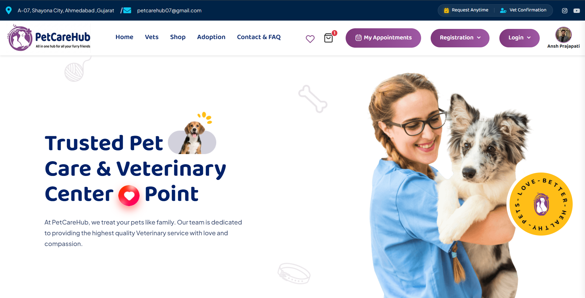
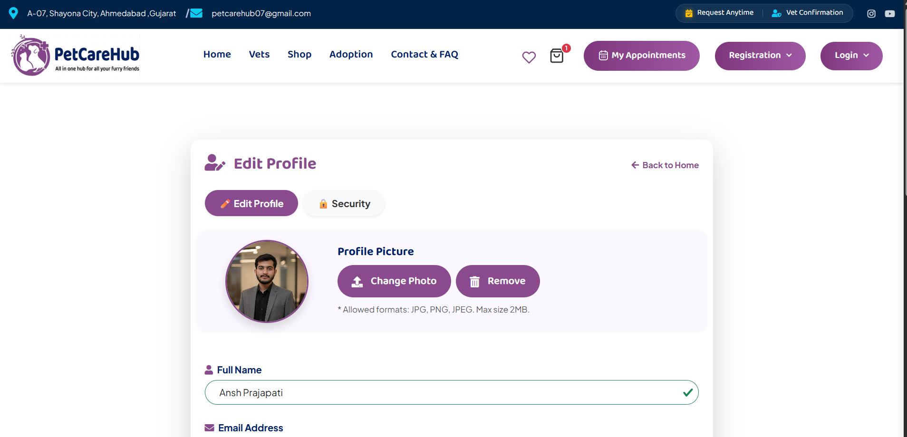
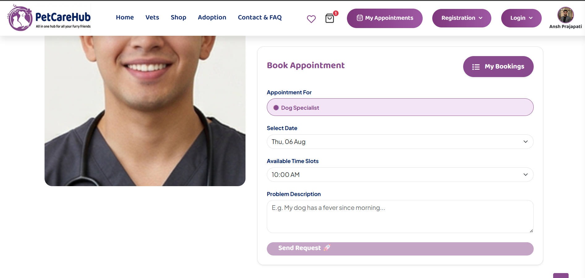
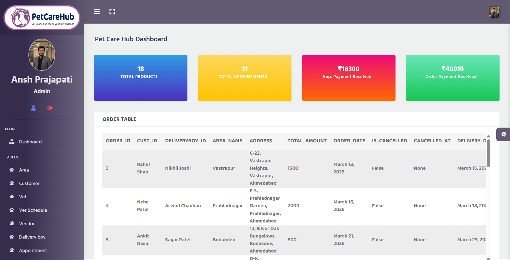
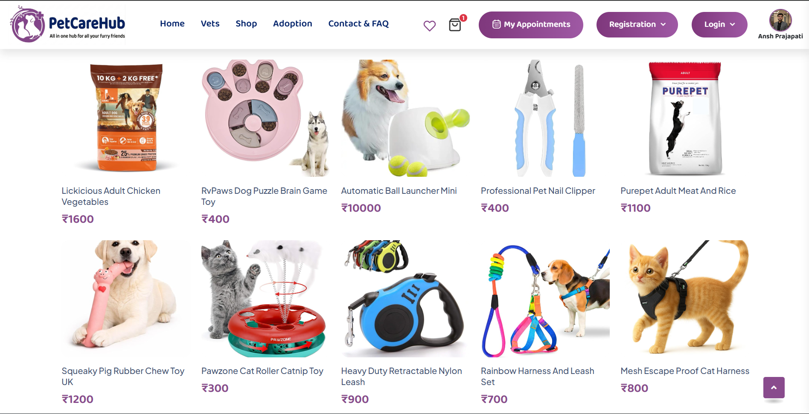
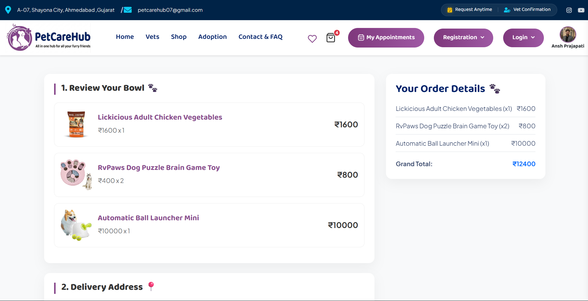

<div align="center">

# 🐾 PetCareHub

**A full-stack, multi-role Pet Care & E-commerce platform built with Django**

Book vet appointments, order pet products, manage vendors and deliveries — all in one system with five dedicated roles.

[](https://www.python.org/)
[](https://www.djangoproject.com/)
[](https://www.sqlite.org/)
[](https://razorpay.com/)
[](https://ai.google.dev/)
[](LICENSE)
[](#-recognition)

</div>

---

## 🏆 Recognition

PetCareHub's pet-adoption initiative is backed by a real-world animal-welfare partnership:

- 📜 **No Objection Certificate** — issued by **Adoption Home Ahmedabad**, authorizing PetCareHub to feature their platform and connect adopters to genuine, verified rescue listings.
- 🤝 **Letter of Appreciation** — from **Adoption Home Ahmedabad**, recognizing PetCareHub's contribution toward responsible pet adoption and animal welfare.

> Special thanks to **Naitik Bhatt** and the team at **Adoption Home Ahmedabad** ([@adoptionhome_ahmedabad](https://instagram.com/adoptionhome_ahmedabad)) for trusting this project and supporting it as a genuine animal-welfare initiative.

Both certificates are viewable directly from the in-app **Adoption** page.

---

## 📌 About the Project

PetCareHub is a final-year BCA capstone project that goes beyond a typical CRUD app — it's a working marketplace with **five distinct user roles**, each with its own dashboard, permissions, and workflows: **Admin, Customer, Vet, Vendor, and Delivery Boy**.

The goal was to simulate a real-world pet-care ecosystem: customers can book vet appointments and shop for pet products, vendors manage their own product catalogs, vets manage schedules and consultations, delivery agents handle order fulfillment, and admins oversee the entire platform.

## ✨ Key Features

**👤 Customer**
- Browse & search pet products, add to cart / wishlist
- Book appointments with verified vets by area/pincode
- Secure checkout with **Razorpay** payment integration
- Order history, appointment history, profile management
- OTP-based email password reset (Gmail SMTP)
- **AI-analyzed reviews** — every product, order, and vet feedback comment is automatically classified by sentiment (see [🤖 AI Feature](#-ai-feature-review-sentiment-analysis) below)
- **AI support chatbot** — a floating assistant on every page answers questions about bookings, orders, and payment policies (see [🤖 AI Chatbot](#-ai-chatbot-customer-support) below)

**🩺 Vet**
- Personal dashboard with schedule management
- Accept/manage appointment requests
- Document-based verification workflow (admin-approved)

**🏪 Vendor**
- Vendor dashboard with sales overview
- Add/update/remove products with images and categories
- Order tracking for their own catalog

**🚴 Delivery Boy**
- Assigned delivery queue
- Status updates for order fulfillment

**🛠️ Admin**
- Central dashboard controlling all roles
- Approve/reject Vet & Vendor registrations
- Manage areas, categories, products, gallery, feedback
- Full CRUD tables for every entity in the system
- Feedback table with color-coded **AI sentiment badges** (Positive / Neutral / Negative) for at-a-glance moderation

 ## 🤖 AI Feature — Review Sentiment Analysis PetCareHub integrates **Google's Gemini API** to automatically analyze the sentiment of every customer-submitted comment — product reviews, order reviews, and vet appointment feedback. **How it works:** 1. When a customer submits a review (from the product page, the "My Orders" page after delivery, or after a vet appointment), the comment text is sent to the Gemini API alongside a system prompt that instructs the model to act strictly as a sentiment classifier. 2. The API returns a structured JSON response — `sentiment` (`positive` / `neutral` / `negative`) and a short `reason` — which is parsed and saved to the `Feedback` model. 3. Sentiment is normalized to English regardless of the input language (Hindi, Hinglish, and English comments are all supported). 4. The admin's Feedback table renders each result as a color-coded badge (🟢 Positive / 🟡 Neutral / 🔴 Negative) so low-rated or negative feedback can be spotted at a glance, without reading every comment. **Reliability:** The integration is wrapped in error handling — if the API is unreachable, times out, or returns an unexpected format, the review still saves normally with the sentiment field left blank. A failure in the AI layer never blocks the core review-submission flow. **Tech used:** Gemini API (`gemini-flash-latest`) called via `requests` (no heavyweight SDK dependency), `python-dotenv` for key management, prompt engineering for structured JSON output.

 ## 🤖 AI Chatbot — Customer Support A floating chat widget (bottom-right corner, available on every customer-facing page) lets visitors ask questions and get instant answers powered by **Google's Gemini API**. **How it works:** 1. The chatbot maintains full conversation context — each message sent to the API includes the prior turns, so follow-up questions are understood correctly. 2. A system prompt gives the model platform-specific knowledge: payment methods (online-only for products, online or pay-at-clinic for vet appointments), and the strike system that governs repeated no-shows on cash-based appointments. 3. Responses automatically match the language the customer is typing in (English, Hindi, or Hinglish). 4. The widget opens with a personalized greeting using the logged-in customer's first name, and shows an animated typing indicator while a response is being generated. **Reliability:** Network or API failures are caught and surfaced as a friendly in-chat message rather than breaking the page. **Tech used:** Gemini API (`gemini-flash-latest`) via `requests`, a Django JSON endpoint (`/client/chatbot-reply/`) for the AJAX exchange, and vanilla JavaScript (`fetch`) on the frontend — no additional chat framework required.

## 🖼️ Screenshots

| Home Page | Customer Dashboard |
|---|---|
|  |  |

| Vet Appointment Booking | Admin Dashboard |
|---|---|
|  |  |

| Product / Shop Page | Checkout (Razorpay) |
|---|---|
|  |  |

## 🧰 Tech Stack

| Layer | Technology |
|---|---|
| Backend | Django 5.2 (Python) |
| Database | SQLite (dev) |
| Frontend | HTML5, CSS3, Bootstrap, JavaScript, jQuery, Swiper.js |
| Auth | Custom role-based auth with hashed passwords + middleware guards |
| Payments | Razorpay |
| AI | Google Gemini API — review sentiment classification |
| AI Chatbot | Google Gemini API — multi-turn support chatbot (custom AJAX endpoint) |
| Email | Django SMTP backend (Gmail) for OTP flows |
| Config | `python-dotenv` for environment-based secrets |

## 🏗️ Project Structure

```
petcare/
├── petcare/         # Project settings, root URLs
├── test2/           # Admin panel app (dashboard, master tables)
├── client/          # Customer-facing app (shop, cart, appointments)
├── vet/              # Vet dashboard app
├── vendor/          # Vendor dashboard app
├── deliveryboy/     # Delivery agent app
├── media/           # User-uploaded files (product images, profile pics)
├── requirements.txt
└── manage.py
```

Each role is a self-contained Django app with its own `*_urls.py`, `*_views.py`, templates, and static assets — keeping the five dashboards cleanly separated.

## 🚀 Getting Started

### Prerequisites
- Python 3.10+
- pip

### 1. Clone the repository
```bash
git clone https://github.com/Anshu073/petcare-hub.git
cd petcare-hub
```

### 2. Create a virtual environment
```bash
python -m venv venv
venv\Scripts\activate       # Windows
source venv/bin/activate    # macOS/Linux
```

### 3. Install dependencies
```bash
pip install -r requirements.txt
```

### 4. Configure environment variables
Copy the example file and fill in your own values:
```bash
cp .env.example .env       # macOS/Linux
copy .env.example .env     # Windows
```
Then open `.env` and set:
- `DJANGO_SECRET_KEY` — any random string (or generate one)
- `EMAIL_HOST_USER` / `EMAIL_HOST_PASSWORD` — your own Gmail + [App Password](https://myaccount.google.com/apppasswords), only needed if you want OTP emails to work
- `GEMINI_API_KEY` — free API key from [Google AI Studio](https://aistudio.google.com/), only needed if you want AI sentiment analysis on reviews to work

### 5. Run migrations
```bash
python manage.py migrate
```

### 6. Start the server
```bash
python manage.py runserver
```
Visit `http://127.0.0.1:8000/`

## 🔐 Security Notes

- All secrets (Django secret key, email credentials) are loaded from a local `.env` file via `python-dotenv` — **never hardcoded**, never committed.
- Passwords are stored using Django's built-in password hashing (`make_password` / `check_password`).
- Role-based middleware restricts access to each dashboard (`client/middleware.py`, `test2/middleware.py`).

## 📸 Adding Screenshots

1. Create a folder named `screenshots/` in the project root.
2. Take clean screenshots of your running app (browser window, no personal data visible) and save them with these exact names so they match the README:
   - `home.png` — landing page
   - `customer-dashboard.png` — customer profile/orders view
   - `appointment-booking.png` — vet appointment booking screen
   - `admin-dashboard.png` — admin dashboard
   - `shop.png` — product listing page
   - `checkout.png` — checkout / payment page
3. Commit and push the `screenshots/` folder along with the rest of the code — GitHub will render the images directly in the README.

*(Tip: 1280×720 or 1440×900, PNG format, keep each file under ~1 MB so the repo stays lightweight.)*

## 🗺️ Roadmap / Possible Improvements

- Migrate from SQLite to PostgreSQL for production
- Add automated tests (pytest-django)
- Dockerize for one-command setup
- Add REST API layer for a future mobile app

## 📄 License

This project is licensed under the MIT License — see the [LICENSE](LICENSE) file for details.

## 👤 Author

**Ansh**
GitHub: [@Anshu073](https://github.com/Anshu073)

Built as a final-year BCA project.

### 🙏 Special Thanks
This project was originally built as a team effort — special thanks to **Vraj Rathod** for his contribution during development.

Feel free to connect if you'd like to discuss the architecture or contribute!
