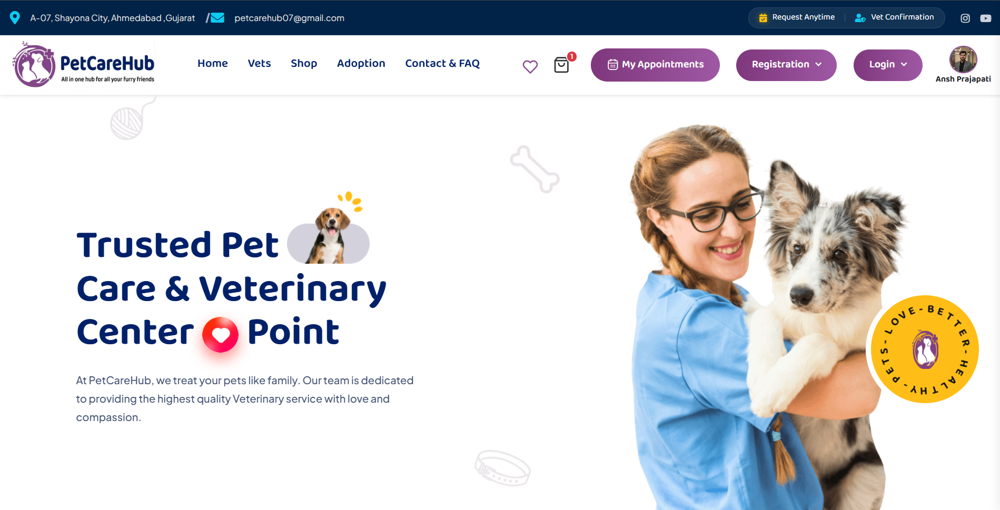
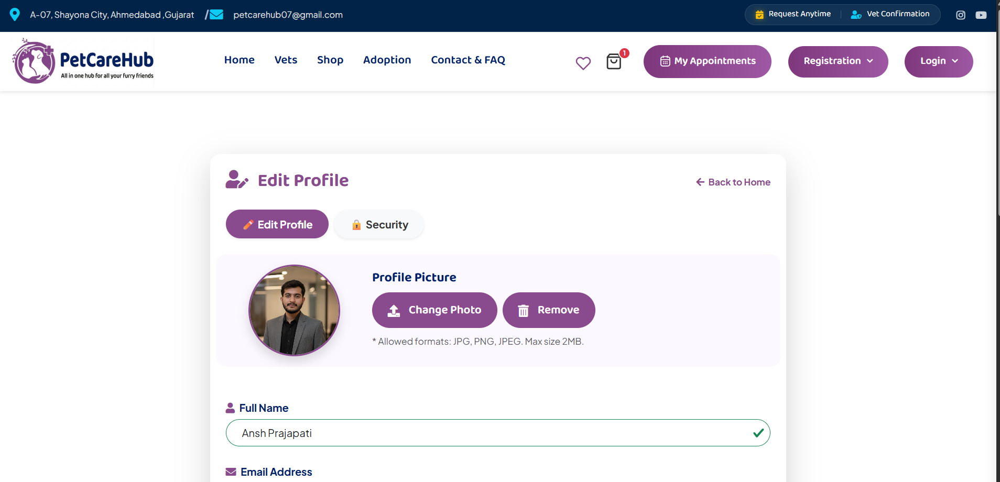
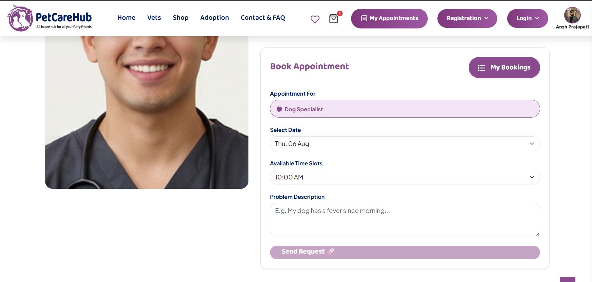
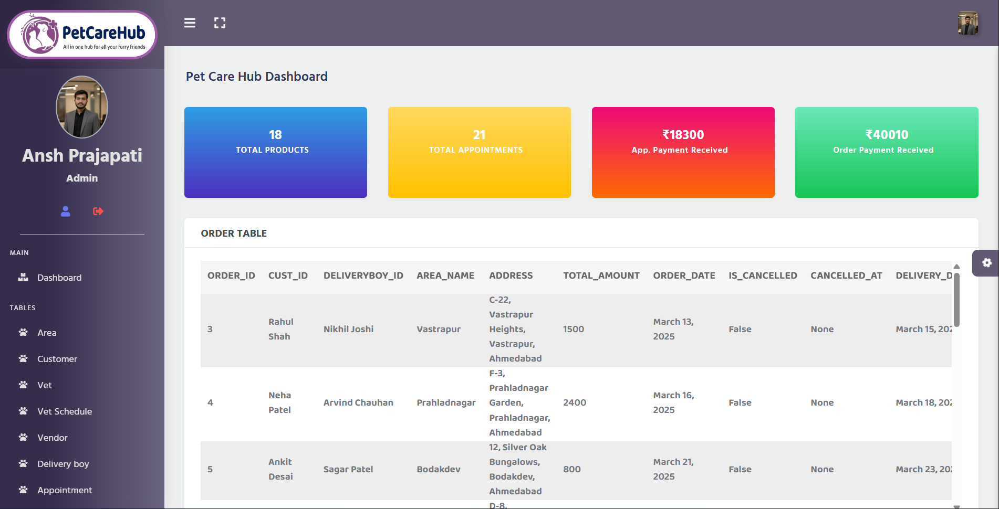
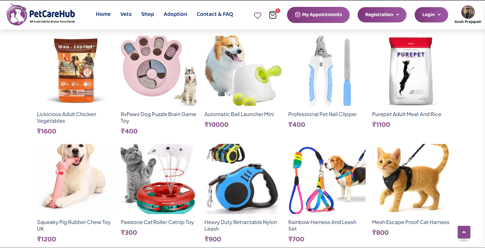
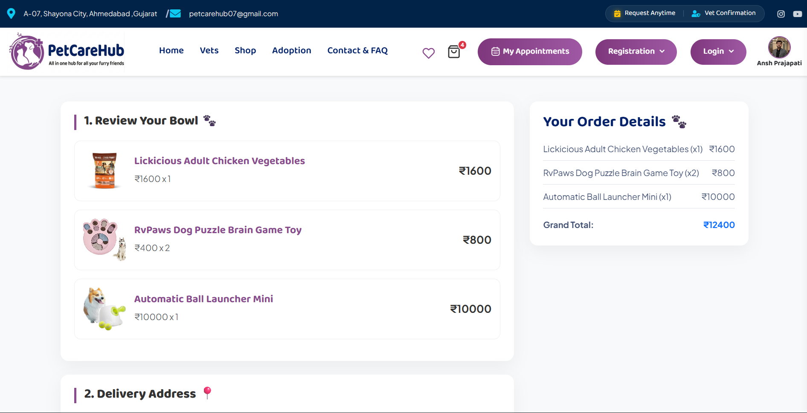

<div align="center">

# 🐾 PetCareHub

**A full-stack, multi-role Pet Care & E-commerce platform built with Django**

Book vet appointments, order pet products, manage vendors and deliveries — all in one system with five dedicated roles.

[](https://www.python.org/)
[](https://www.djangoproject.com/)
[](https://www.postgresql.org/)
[](https://razorpay.com/)
[](https://ai.google.dev/)
[](https://cloudinary.com/)
[](https://petcare-hub-uw49.onrender.com)
[](LICENSE)
[](#-recognition)

### 🌐 [Live Demo → petcare-hub-uw49.onrender.com](https://petcare-hub-uw49.onrender.com)
<sub>💡 Tip: Ctrl + Click (Mac: Cmd + Click) to open in a new tab</sub>

> ⚠️ **Demo Disclaimer:** This is an academic demonstration project. All veterinarians, certificates, medical reports, prescriptions, and user data shown are fictitious and AI-generated for demonstration purposes only. Any resemblance to real persons, institutions, or organizations is purely coincidental. The platform is not intended to provide real medical, veterinary, or financial advice.

</div>

---

## 🔑 Test Credentials

Use these to explore the platform without registering:

| Role | Email | Password |
|---|---|---|
| **Customer** | `ganesh123@gmail.com` | `Ganesh@123` |
| **Vendor 1** | `Furryfriend08@gmail.com` | `Furry@08` |
| **Vendor 2** | `Petzone33@gmail.com` | `Petzone@33` |
| **Vet** | `Sumit89@gmail.com` | `Sumit@89` |
| **Delivery Boy** | `yashtrivedi04@gmail.com` | `Yash@004` |
| **Admin** | `officialpetcare@gmail.com` | `Petcare@9998` |

> 💡 First load may take **30–50 seconds** — the free Render instance spins down after inactivity (handled by UptimeRobot to minimize this).

---

## 🏆 Recognition

PetCareHub's pet-adoption initiative is backed by a real-world animal-welfare partnership:

- 📜 **No Objection Certificate** — issued by **Adoption Home Ahmedabad**, authorizing PetCareHub to feature their platform and connect adopters to genuine, verified rescue listings.
- 🤝 **Letter of Appreciation** — from **Adoption Home Ahmedabad**, recognizing PetCareHub's contribution toward responsible pet adoption and animal welfare.

> Special thanks to **Naitik Bhatt** and the team at **Adoption Home Ahmedabad** ([@adoptionhome_ahmedabad](https://instagram.com/adoptionhome_ahmedabad)) for trusting this project and supporting it as a genuine animal-welfare initiative.

Both certificates are viewable directly from the in-app **Adoption** page.

---

## 📌 About the Project

PetCareHub is a final-year BCA capstone project that goes beyond a typical CRUD app — it's a working marketplace with **five distinct user roles**, each with its own dashboard, permissions, and workflows: **Admin, Customer, Vet, Vendor, and Delivery Boy**.

The goal was to simulate a real-world pet-care ecosystem: customers can book vet appointments and shop for pet products, vendors manage their own product catalogs, vets manage schedules and consultations, delivery agents handle order fulfillment, and admins oversee the entire platform.

---

## ✨ Key Features

**👤 Customer**
- Browse & search pet products, add to cart / wishlist
- Book appointments with verified vets by area/pincode
- Secure checkout with **Razorpay** payment integration
- Order history, appointment history, profile management
- OTP-based email password reset (Gmail SMTP)
- **AI-analyzed reviews** — every product, order, and vet feedback comment is automatically classified by sentiment
- **AI support chatbot** — a floating assistant on every page answers questions about bookings, orders, and payment policies

**🩺 Vet**
- Personal dashboard with schedule management
- Accept/manage appointment requests
- Document-based verification workflow (admin-approved)
- AI-generated qualification certificates for demo purposes

**🏪 Vendor**
- Vendor dashboard with sales overview
- Add/update/remove products with images and categories
- Order tracking for their own catalog
- Delivery boy management

**🚴 Delivery Boy**
- Assigned delivery queue
- Status updates for order fulfillment

**🛠️ Admin**
- Central dashboard controlling all roles
- Approve/reject Vet & Vendor registrations
- Manage areas, categories, products, gallery, feedback
- Full CRUD tables for every entity in the system
- Feedback table with color-coded **AI sentiment badges** (Positive / Neutral / Negative)

---

## 🤖 AI Feature — Review Sentiment Analysis

PetCareHub integrates **Google's Gemini API** to automatically analyze the sentiment of every customer-submitted comment — product reviews, order reviews, and vet appointment feedback.

**How it works:**
1. When a customer submits a review, the comment text is sent to the Gemini API alongside a system prompt that instructs the model to act strictly as a sentiment classifier.
2. The API returns a structured JSON response — `sentiment` (`positive` / `neutral` / `negative`) and a short `reason` — which is parsed and saved to the `Feedback` model.
3. Sentiment is normalized to English regardless of the input language (Hindi, Hinglish, and English comments are all supported).
4. The admin's Feedback table renders each result as a color-coded badge (🟢 Positive / 🟡 Neutral / 🔴 Negative).

**Reliability:** The integration is wrapped in error handling — if the API is unreachable, times out, or returns an unexpected format, the review still saves normally with the sentiment field left blank.

**Tech used:** Gemini API (`gemini-flash-latest`) called via `requests`, `python-dotenv` for key management, prompt engineering for structured JSON output.

---

## 🤖 AI Chatbot — Customer Support

A floating chat widget (bottom-right corner, available on every customer-facing page) lets visitors ask questions and get instant answers powered by **Google's Gemini API**.

**How it works:**
1. The chatbot maintains full conversation context — each message sent to the API includes the prior turns, so follow-up questions are understood correctly.
2. A system prompt gives the model platform-specific knowledge: payment methods, and the strike system that governs repeated no-shows on cash-based appointments.
3. Responses automatically match the language the customer is typing in (English, Hindi, or Hinglish).
4. The widget opens with a personalized greeting using the logged-in customer's first name, and shows an animated typing indicator while a response is being generated.

**Tech used:** Gemini API (`gemini-flash-latest`) via `requests`, a Django JSON endpoint (`/client/chatbot-reply/`) for the AJAX exchange, and vanilla JavaScript (`fetch`) on the frontend.

---

## 🖼️ Screenshots

| Home Page | Customer Dashboard |
|---|---|
|  |  |

| Vet Appointment Booking | Admin Dashboard |
|---|---|
|  |  |

| Product / Shop Page | Checkout (Razorpay) |
|---|---|
|  |  |

---

## 🧰 Tech Stack

| Layer | Technology |
|---|---|
| Backend | Django 5.2 (Python 3.12) |
| Database | PostgreSQL (Neon — production), SQLite (local dev) |
| Media Storage | Cloudinary (all user uploads — images, PDFs, reports) |
| Frontend | HTML5, CSS3, Bootstrap, JavaScript, jQuery, Swiper.js |
| Auth | Custom role-based auth with hashed passwords + middleware guards |
| Payments | Razorpay |
| AI | Google Gemini API — review sentiment classification |
| AI Chatbot | Google Gemini API — multi-turn support chatbot |
| Email | Django SMTP backend (Gmail) for OTP flows |
| Hosting | Render (free tier) + UptimeRobot (uptime monitoring) |
| Config | `python-dotenv` for environment-based secrets |

---

## 🏗️ Project Structure

```
petcare/
├── petcare/         # Project settings, root URLs
├── test2/           # Admin panel app (dashboard, master tables)
├── client/          # Customer-facing app (shop, cart, appointments)
├── vet/             # Vet dashboard app
├── vendor/          # Vendor dashboard app
├── deliveryboy/     # Delivery agent app
├── fixtures/        # Initial data (areas) for production seeding
├── requirements.txt
└── manage.py
```

Each role is a self-contained Django app with its own `*_urls.py`, `*_views.py`, templates, and static assets — keeping the five dashboards cleanly separated.

---

## 🚀 Getting Started (Local Setup)

### Prerequisites
- Python 3.10+
- pip

### 1. Clone the repository
```bash
git clone https://github.com/Anshu073/petcare-hub.git
cd petcare-hub
```

### 2. Create a virtual environment
```bash
python -m venv venv
venv\Scripts\activate       # Windows
source venv/bin/activate    # macOS/Linux
```

### 3. Install dependencies
```bash
pip install -r requirements.txt
```

### 4. Configure environment variables
Copy the example file and fill in your own values:
```bash
cp .env.example .env       # macOS/Linux
copy .env.example .env     # Windows
```

Then open `.env` and set:
- `DJANGO_SECRET_KEY` — any random string
- `EMAIL_HOST_USER` / `EMAIL_HOST_PASSWORD` — Gmail + App Password (for OTP emails)
- `GEMINI_API_KEY` — free key from [Google AI Studio](https://aistudio.google.com/)
- `CLOUDINARY_CLOUD_NAME` / `CLOUDINARY_API_KEY` / `CLOUDINARY_API_SECRET` — from [Cloudinary](https://cloudinary.com/) (for media uploads)

### 5. Run migrations
```bash
python manage.py migrate
```

### 6. Start the server
```bash
python manage.py runserver
```
Visit `http://127.0.0.1:8000/`

---

## ☁️ Production Setup

The live demo runs on:
- **Render** — free web service hosting
- **Neon** — free PostgreSQL database (lifetime free tier)
- **Cloudinary** — free media storage (images, PDFs, reports)
- **UptimeRobot** — free uptime monitoring to prevent Render sleep

Environment variables are set directly in Render's dashboard — never committed to the repository.

---

## 🔐 Security Notes

- All secrets loaded from `.env` via `python-dotenv` — never hardcoded, never committed.
- Passwords stored using Django's built-in hashing (`make_password` / `check_password`).
- Role-based middleware restricts access to each dashboard.
- `.env` is listed in `.gitignore`.

---

## 🗺️ Roadmap / Possible Improvements

- Add automated tests (pytest-django)
- Dockerize for one-command setup
- Add REST API layer for a future mobile app
- Signed Cloudinary URLs for private document access

---

## 📄 License

This project is licensed under the MIT License — see the [LICENSE](LICENSE) file for details.

---

## 👤 Author

**Ansh Prajapati**
GitHub: [@Anshu073](https://github.com/Anshu073)

Built as a final-year BCA project.

### 🙏 Special Thanks
This project was originally built as a team effort — special thanks to **Vraj Rathod** for his contribution during development.

Feel free to connect if you'd like to discuss the architecture or contribute!
